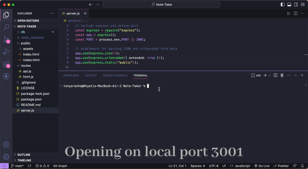

# SVG-Logo-Maker 

## Description

This Note Taker application can be used to write and save notes. This application will use an Express.js back end and will save and retrieve note data from a JSON file. 

- [Application](#Application)
- [Technologies Used](#TechnologiesUsed)
- [Installation](#Installation)
- [Usage](#Usage)
- [Credits](#Credits)
- [License](#License)

## Application

The following video shows the application's appearance and functionality:

## Technologies Used

Javascript  
NODE JS  
Express.js  

## Installation

To run application locally, check if you have Node.js installed by typing "node -v" in your command line. If node is not installed, visit the Node.js website to install. Next, clone this project repository to your computer. Use the command "npm install" to install dependecies (Express.js & UUID). Type "node server.js" or "npm start" to start server.

## Usage

You can access the website through deployed [Heroku link](https://eko-note-taker.herokuapp.com/).  
Type a new note title and note text in the designated input areas.  
Click the 'save' icon on the top right corner to save a new note.  
Access and open saved notes by selecting a note in the list located on the left side.  
Click the red trash can icon to delete a saved note. 

## Credits

https://nodejs.org/en  
https://www.w3schools.com  

## License

MIT License.
For more information on the license, please refer to the LICENSE file in the repo
